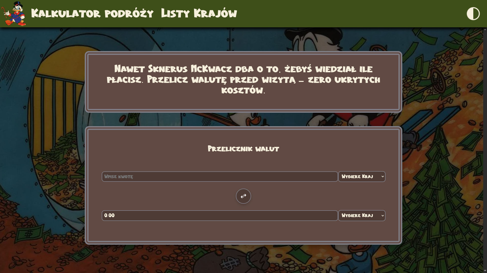
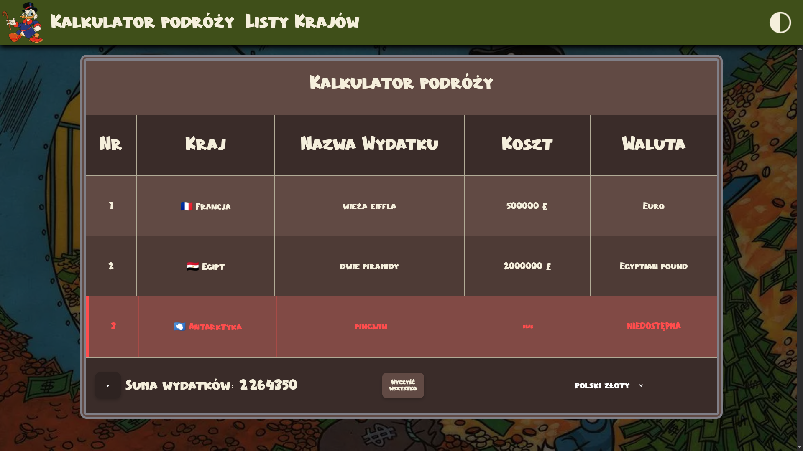

# Kantor Sknerusa McKwacza
## Spis treści
- [Zespół](#zespół)
- [Opis](#opis)
- [Podgląd projektu](#podgląd-projektu)
- [Technologie](#technologie)
- [Uruchomienie projektu lokalnie](#uruchomienie-projektu-lokalnie)

## Zespół
Projekt został wykonany przez:
- [Tikeer](https://github.com/Tikeer)
- [Szymonsh1](https://github.com/Szymonsh1)
- [pawelsiemieniuk](https://github.com/pawelsiemieniuk)

## Opis

### Projekt został stworzony w celu zebrania najpotrzebniejszych narzędzi w planowaniu podróży i wydatków z nią związanych.
- Na stronie głównej możemy przeliczyć walutę dowolnych dwóch krajów, bez ich znajomości.
- Strona kalkulatora podróży daje możliwość zaplanowania kolejnych wydatków w różnych miejscach na ziemi oraz podliczenia całkowitego kosztu w wybranej walucie.
- Na stronie listy krajów znajdują się podstawowe informacje dotyczące wybranych krajów.

## Podgląd projektu





## Technologie
- HTML
- JavaScript
- CSS
- Node.js

## Uruchomienie projektu lokalnie

### Wymagania
 * Zainstalowany [Node.js](https://nodejs.org/) razem z menadżerem pakietów [npm](https://www.npmjs.com/get-npm)

### Przygotowanie projektu
Pobranie i przejście do głównego folderu projektu:
```
git clone https://github.com/KantorMcKwacza/kantormckwacza.github.io.git
cd kantormckwacza.github.io
```
Instalacja wymaganych pakietów:
```
npm install
```
Uruchomienie aplikacji:
```
npm start
```
Aplikacja zostanie uruchomiona lokalnie i dostępna pod adresem `http://localhost:4200/`

